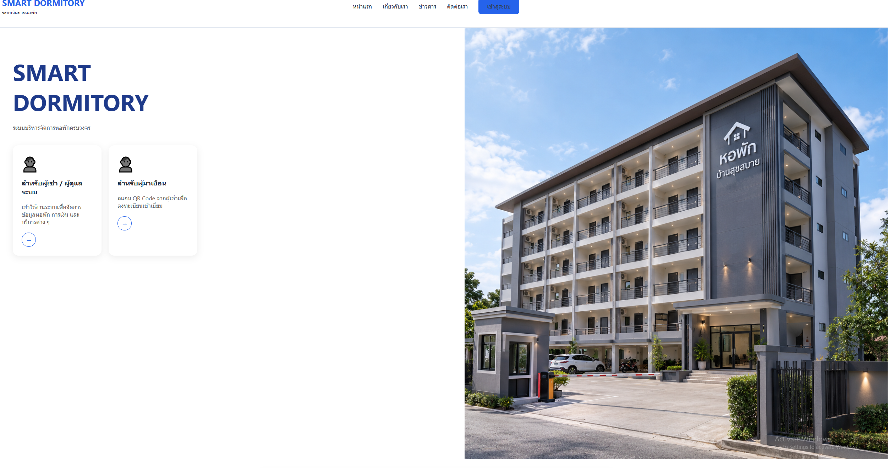
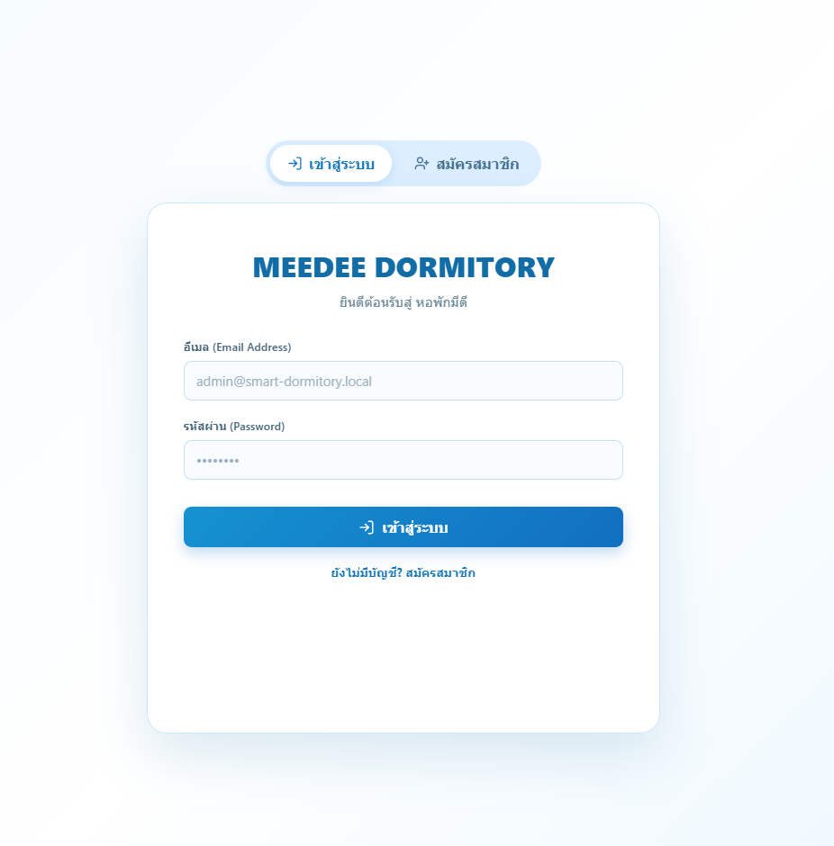
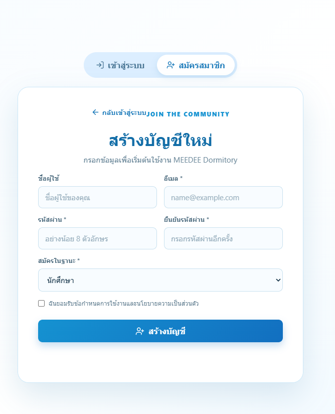
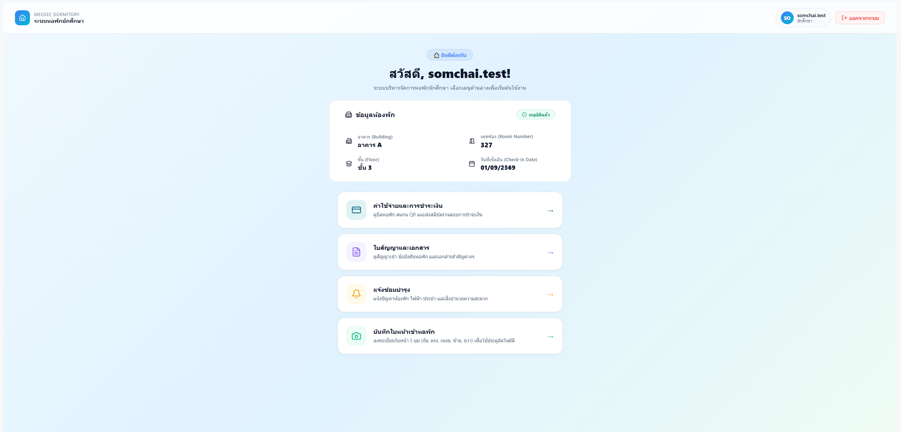
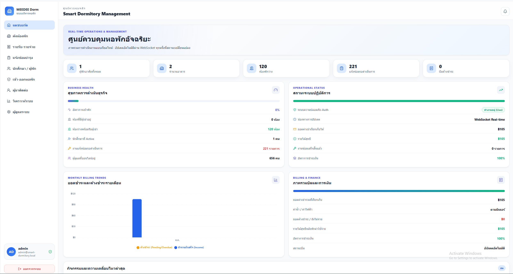
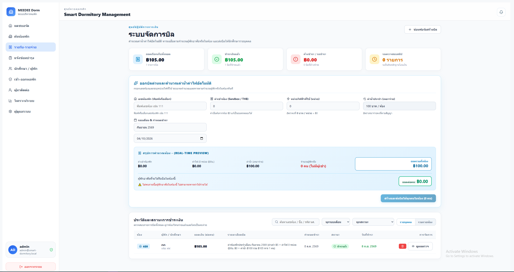

# Smart Dormitory Frontend

Frontend สำหรับระบบจัดการหอพัก พัฒนาด้วย React, TypeScript และ Vite เพื่อให้ผู้ดูแลหอพักและนักศึกษาจัดการข้อมูลห้องพัก ค่าใช้จ่าย การแจ้งซ่อม และผู้มาติดต่อผ่านเว็บแอปพลิเคชันเดียว

## Frontend Highlights

- Dashboard สำหรับ Admin พร้อมข้อมูลห้องพัก นักศึกษา รายรับ-รายจ่าย และงานแจ้งซ่อม
- Student portal สำหรับดูข้อมูลการเข้าพัก เอกสาร สัญญา และรายการบิล
- ระบบเลือกห้องพักและขั้นตอนสมัครเข้าพักแบบ Wizard
- ระบบ Billing สำหรับดูบิล แยกรายการค่าเช่า ค่าน้ำ ค่าไฟ และอัปโหลดสลิปชำระเงิน
- ระบบ Maintenance สำหรับสร้างและติดตามสถานะการแจ้งซ่อม
- ระบบ Visitor สำหรับลงทะเบียน อนุมัติ Check-in และ Check-out ผู้มาติดต่อ
- ระบบแจ้งเตือนสำหรับ Admin แบบ realtime ผ่าน Socket.IO
- เชื่อมต่อ REST API ผ่าน Axios พร้อมจัดการสถานะ authentication และข้อผิดพลาดจาก server
- รองรับหน้า Monitor สำหรับแสดงสถานะการเข้าออกและผลการตรวจสอบจาก backend

## My Contributions

- พัฒนาและปรับปรุงหน้าจอ Admin Dashboard และหน้าจัดการข้อมูลหลักของหอพัก
- พัฒนา flow การสมัครเข้าพัก ตั้งแต่กรอกข้อมูล อัปโหลดเอกสาร เลือกห้อง จนถึงตรวจสอบสัญญา
- พัฒนา Student Billing ตั้งแต่เลือกหลายบิล สร้าง QR อัปโหลดสลิป ไปจนถึงติดตามผลการตรวจสอบ
- พัฒนา Visitor Management สำหรับค้นหา กรอง อนุมัติ และบันทึกเวลาเข้า-ออก
- ออกแบบการแจ้งเตือน success/error และ notification history ให้ใช้งานต่อเนื่องข้าม refresh
- แยกส่วน UI, context, service และ shared components เพื่อให้ดูแลและขยายระบบได้ง่าย
- ตรวจสอบคุณภาพงานด้วย lint, TypeScript build และ unit tests

## Technology Stack

| Category | Technology |
| --- | --- |
| Frontend | React 19, TypeScript, Vite |
| Routing | React Router |
| API Client | Axios |
| Realtime | Socket.IO Client |
| UI and Icons | CSS Modules, Lucide React |
| Data Visualization | Recharts |
| Tables | TanStack React Table |
| Face Detection UI | TensorFlow.js, BlazeFace, MediaPipe |
| Quality Tools | ESLint, TypeScript, Node Test Runner |

## Frontend Architecture

```text
src/
├── components/       # Shared components and notification UI
├── componants/       # Admin dashboard, homepage, and user page modules
├── contexts/         # Authentication and application contexts
├── modules/          # Feature modules such as auth, admin, visitor, and face verification
├── services/         # Axios API client, realtime client, and API URL helpers
├── assets/           # Images and static frontend assets
├── App.tsx           # Application providers and router entry
└── main.tsx          # Vite application entry point
```

การเชื่อมต่อข้อมูลใช้ `src/services/api.ts` เป็น Axios instance กลาง และใช้ `src/services/realtime.ts` สำหรับ Socket.IO โดย frontend รับ URL ของ backend ผ่าน environment variable `VITE_API_URL`

## Available Scripts

```bash
bun run dev       # Start Vite development server
bun run build     # Type-check and create production build
bun run lint      # Run ESLint
bun run test      # Run unit tests
bun run preview   # Preview production build locally
```

## Screenshots and Demo

- Client
<p align="center">
  
</p>

<p align="center">
  
</p>

<p align="center">
  
</p>

<p align="center">
  
</p>

- Admin
<p align="center">
  
</p>

<p align="center">
  
</p>

## What I Learned

- การออกแบบ Frontend แบบ Modular ที่แบ่ง feature และความรับผิดชอบอย่างชัดเจน
- การจัดการ authentication, protected routes และ session ที่หมดอายุ
- การเชื่อมต่อ API จริง 
- การทำ responsive interface สำหรับ workflow ของ Admin และ Student
- การตรวจสอบคุณภาพโค้ดด้วย lint, build และ automated tests

## Project Status

โปรเจกต์อยู่ระหว่างการพัฒนา โดย frontend มีหน้าจอและ flow หลักของ Admin, Student, Billing, Maintenance และ Visitor แล้ว การใช้งานข้อมูลจริงต้องทำงานร่วมกับ backend API ที่เกี่ยวข้อง

## Author

- Name: `<Jarus>`
- Role: Frontend Developer
- Email: `<jarus2547@gmail.com>`
- GitHub: `<https://github.com/Jarus2004/>`
