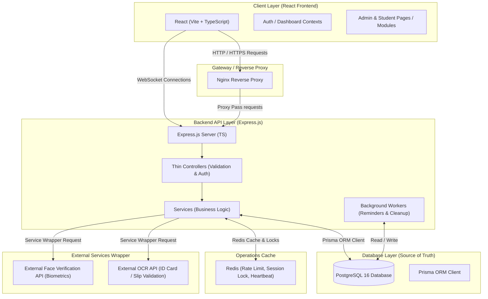
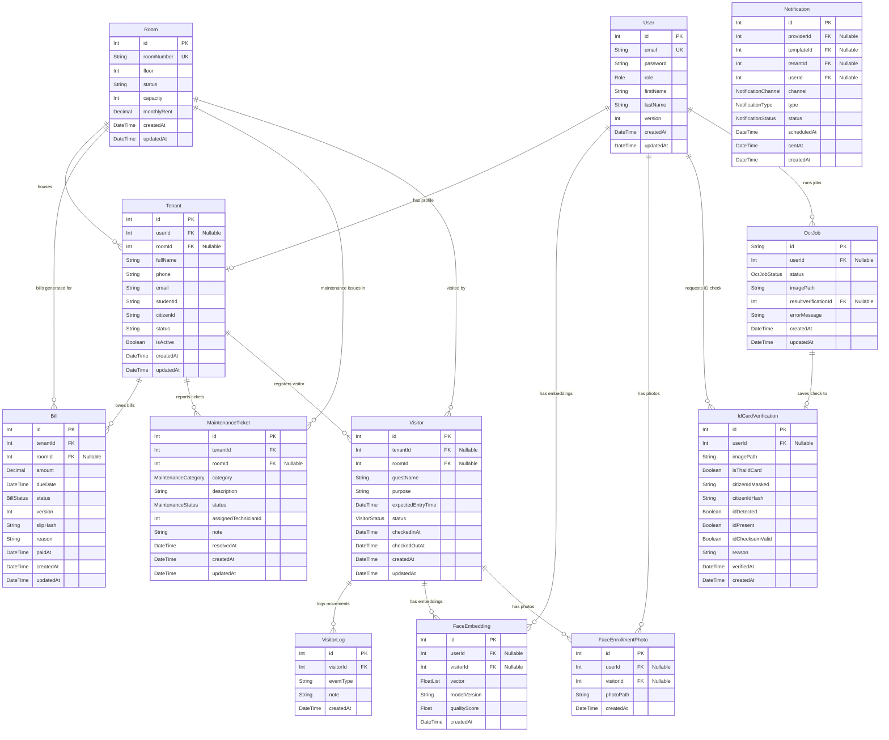
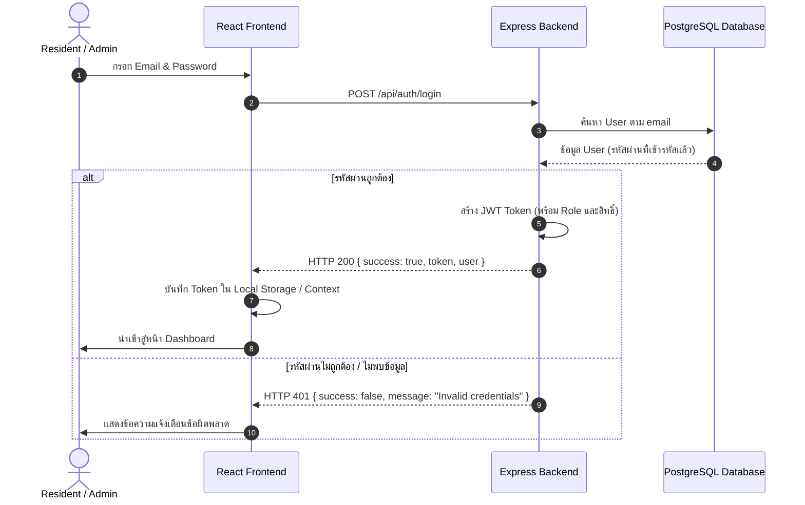
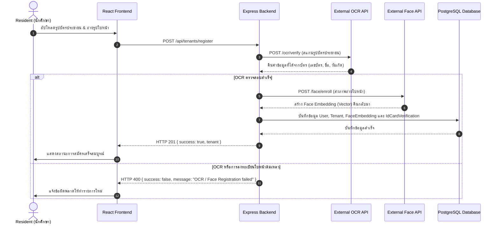
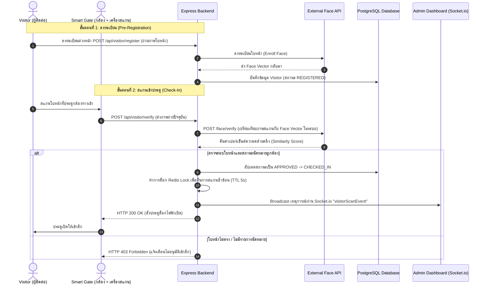
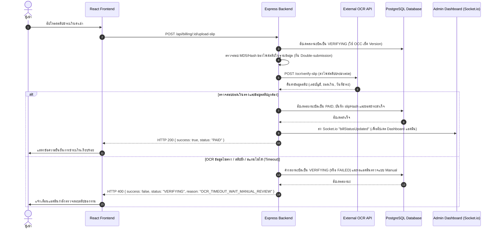
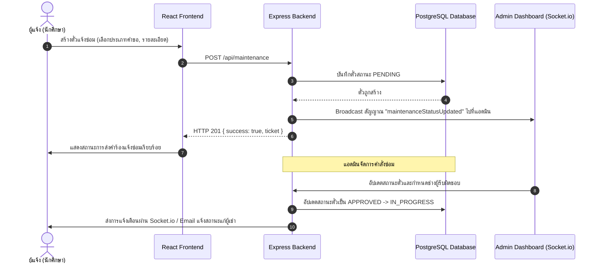
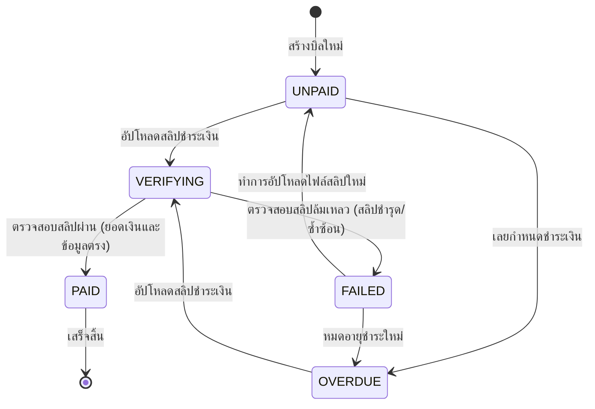
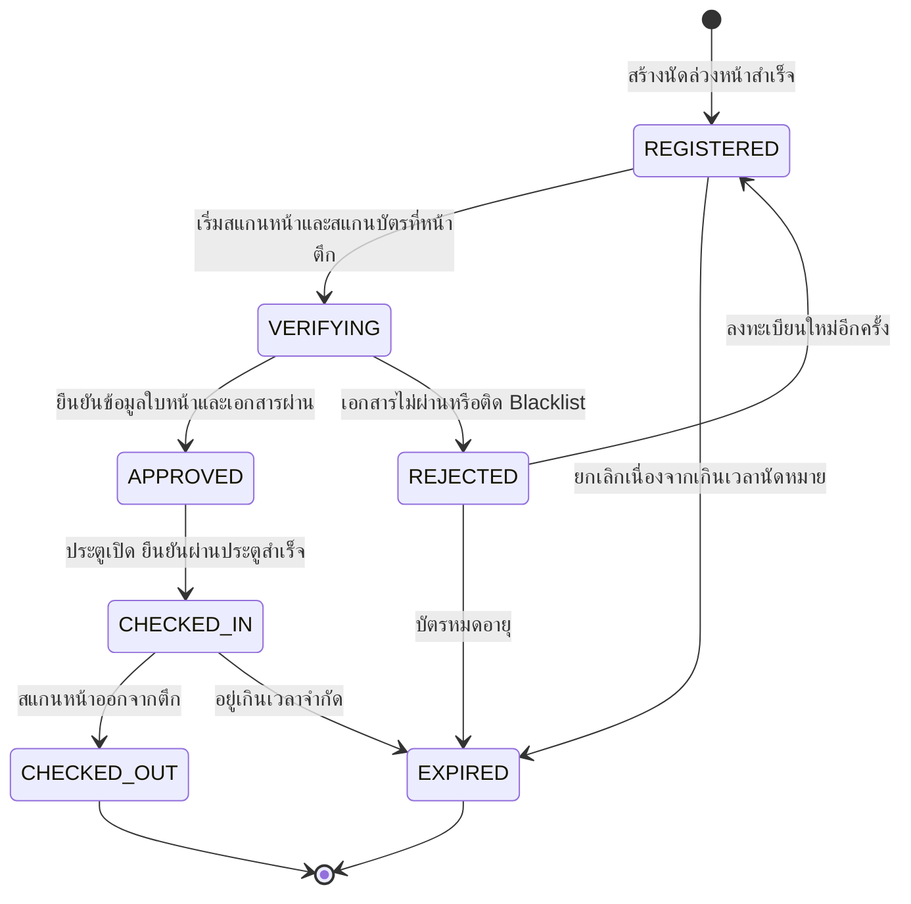
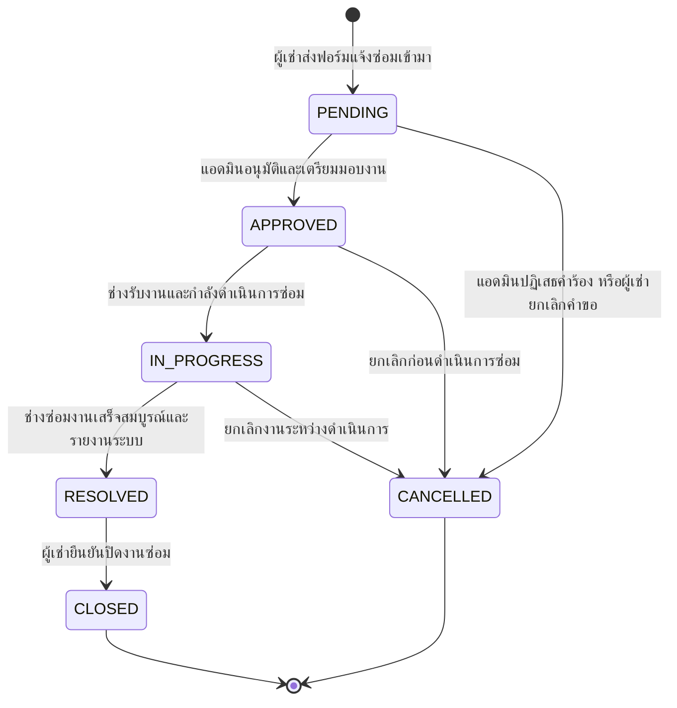

# Smart Dormitory Management System — System Diagrams

เอกสารนี้รวบรวมไดอะแกรมการทำงานทั้งหมดของระบบ Smart Dormitory Management System ทั้งในฝั่ง Backend (Node.js/Express/TypeScript) และ Frontend (React/Vite/TypeScript)

---

## 1. System Architecture (สถาปัตยกรรมภาพรวมของระบบ)

ไดอะแกรมจำลองโครงสร้างและความสัมพันธ์ของเลเยอร์ต่าง ๆ ภายในระบบ:

---

## 2. Database Entity Relationship Diagram (ERD)

แบบจำลองความสัมพันธ์ของข้อมูล (Entity Relationships) ที่อยู่บน PostgreSQL โดยอิงจาก [schema.prisma](file:///C:/Users/raphi/Documents/smart-dormitory-backend/prisma/schema.prisma):

---

## 3. Core Business Workflows & Sequence Diagrams (โฟลว์การทำงานระบบ)

### 3.1 Authentication / Login Flow

---

### 3.2 Resident (Tenant) Registration Flow
การลงทะเบียนผู้เช่า (นักศึกษา) ร่วมกับการสแกนบัตรประชาชนด้วย OCR และจัดเก็บลายนิ้วมือ/ใบหน้า:

---

### 3.3 Visitor Access Flow (ระบบผู้มาติดต่อ)
กระบวนการลงทะเบียนนัดหมายของผู้ติดต่อและตรวจสอบใบหน้าก่อนเข้า-ออกอาคาร:

---

### 3.4 Billing Payment Verification Flow (สแกนสลิป)
การสแกนสลิปโอนเงินอัตโนมัติด้วย OCR เพื่อชำระค่าเช่า:

---

### 3.5 Maintenance Ticketing Flow (ระบบแจ้งซ่อม)

---

## 4. State Machines (แผนผังการควบคุมสถานะ)

ระบบใช้แนวทางการควบคุมสถานะอย่างเข้มงวด (State Machine Contracts) เพื่อให้การไหลของข้อมูลถูกต้องและปลอดภัยตามกฎธุรกิจ:

### 4.1 Billing Status State Machine

---

### 4.2 Visitor Access State Machine

---

### 4.3 Maintenance Ticket State Machine

